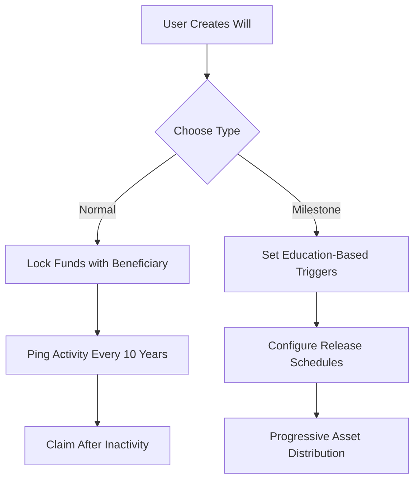

# 🌐 **Axienz — Secure Your LEGACY Onchain**

A decentralized, trustless smart will system on the **BNB Chain Testnet** designed to protect your digital assets, educational wealth, and intellectual property — and pass them down **automatically** to the next generation.

---

## 📌 **Overview**

Losing access to private keys or seed phrases means losing everything. But what if there were a **decentralized solution** that could **automate inheritance**, protect **scholarships**, and ensure **intellectual property lives on**?

**Axienz** is a secure, blockchain-powered platform enabling you to:

* Safeguard your assets.
* Automate asset transfer via programmable wills.
* Preserve **educational milestones** and legacy wealth — all **onchain**.

---

## ✨ **Key Features**

### 📜 Dual Will System

* **Normal Wills**: One-time transfer with inactivity detection (default 10 years, customizable).
* **Milestone Wills**: Conditional asset release based on **academic progress** (e.g., graduation, research submission).

### 🎓 Education-Oriented Asset Distribution

* **Scholarship automation** via blockchain-verified grants.
* **Milestone-based disbursement** to students or researchers.
* **Onchain transfer of certificates, research, and NFTs**.

### ⏰ Automated Time-Based Execution

* **Inactivity check** (default 10 years, adjustable for testing).
* **1-year withdrawal cooldown**.
* **Custom schedules** for milestone-triggered payouts.

### 🔒 Trustless Security Architecture

* **Immutable beneficiaries** — once set, can't be altered.
* **Anti-front running** and **signature verification**.
* **Funds locked** until conditions are met.

---

## 🏗️ **Smart Contract Deployment**

| Network               | Contract Address                                                                                                               |
| --------------------- | ------------------------------------------------------------------------------------------------------------------------------ |
| **BNB Chain Testnet** | [`0x3d78af7cedc14ddf2c35637eb664f4a1837c2da7`](https://testnet.bscscan.com/address/0x3d78af7cedc14ddf2c35637eb664f4a1837c2da7) |

---

## 🧑‍💻 **Developer Quick Start**

### 🛠 Installation

```bash
npm install @openzeppelin/contracts ethers
```

### 📥 Claiming Will as a Beneficiary (Solidity Snippet)

```solidity
function getNormalWillAsBeneficiary(address _beneficiary) external view returns (address[] memory owners, uint256[] memory amounts) {
    uint256 count = 0;
    for (uint256 i = 0; i < willOwners.length; i++) {
        address user = willOwners[i];
        if (hasNormalWill[user] && normalWills[user].beneficiary == _beneficiary && !normalWills[user].isClaimed) {
            count++;
        }
    }
    owners = new address[](count);
    amounts = new uint256[](count);
    uint256 index = 0;
    for (uint256 i = 0; i < willOwners.length; i++) {
        address user = willOwners[i];
        if (hasNormalWill[user] && normalWills[user].beneficiary == _beneficiary && !normalWills[user].isClaimed) {
            owners[index] = user;
            amounts[index] = normalWills[user].amount;
            index++;
        }
    }
    return (owners, amounts);
}
```

---

## 🔄 **User Flow**



---

## 🛡️ **Security Architecture**

* 🔐 **Funds are locked** until predefined conditions are satisfied.
* 📅 **Temporal rules**:

  * Custom inactivity lock.
  * Time-based milestone checks.
  * Withdrawal cooldown of 1 year.
* ✅ **Identity validation**:

  * Beneficiaries must be different from owners.
  * Signature-based authorization required.
* 💸 **Financial controls**:

  * Prevents overclaims via percentage capping.
  * Small platform fee deducted at will creation.

---

## 🔧 **Maintenance & Management**

* ⏳ **Reset inactivity timer**
* 🔁 **Update beneficiary (within limits)**
* 💰 **Withdraw after cooldown**

---

## 🌍 **Planned Enhancements**

* 🌐 **Cross-chain support** (e.g., Ethereum, Polygon)
* 🖼️ **NFT deposits** (for certificates, research, and creative IP)
* 🏛️ **University-grade scholarship management**
* 🔍 **Block Explorer integrations** for transparency

---

## 🤝 **Contribution Guidelines**

We welcome contributors! Here's how to get involved:

```bash
# 1. Fork the repository
# 2. Create your feature branch
git checkout -b feature/MyAmazingFeature

# 3. Commit your changes
git commit -m "Add MyAmazingFeature"

# 4. Push the branch
git push origin feature/MyAmazingFeature

# 5. Open a pull request
```

---

## 📝 **License**

This project is licensed under the [MIT License](https://opensource.org/licenses/MIT).

---

## 🔗 **Connect & Contribute**

> Axienz isn’t just a smart contract. It’s a **movement** toward democratizing inheritance, protecting digital legacy, and empowering educational wealth — onchain.

🚀 **Start building with us today on BNB Chain Testnet**
🔗 [GitHub Repository →](https://github.com/Debanjannnn/Axienz)

---
